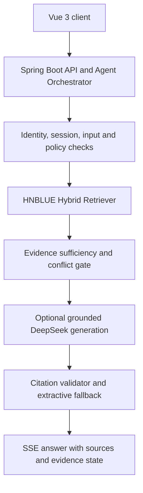

# HNBLUE — Hainan Blue Carbon Digital Application System

English · [简体中文](README.zh-CN.md)

HNBLUE is a full-stack research and management prototype for blue-carbon data governance, regional visualization, biomass-model inference, governance workflows, and knowledge-assisted analysis in Hainan, China.

The project integrates a Vue 3 client, a Spring Boot application and agent-orchestration layer, MySQL, Redis, a Flask/CatBoost inference service, and an HNBLUE-owned hybrid RAG service. DeepSeek is optional and is used only after retrieval and evidence checks; the system still returns extractive evidence when generation is unavailable.

> **Scope:** HNBLUE is a research, teaching, and decision-support system. It is not an official carbon-accounting, carbon-credit verification, or production monitoring platform. Model output, literature summaries, remote-sensing proxies, and AI responses require domain review before scientific or operational use.

## Highlights

- Source-aware blue-carbon data catalog with region, year, indicator, quality, proxy, simulation, citation, and license metadata.
- Public data explorer and governance workbench for mangrove area, regional indicators, literature evidence, and work orders.
- Hainan city/county base map with public boundary geometry and clearly labelled synthetic metric overlays.
- Browsing APIs for BAAD, Tallo, ChinAllomeTree, and GWM-style external data packages.
- Spring Boot proxy for single and batch CatBoost inference.
- Virtual-plot scenarios, carbon-value conversion, and offline model interpretation artifacts.
- Agentic RAG with BM25, character TF-IDF, LSA, title retrieval, weighted RRF fusion, evidence gates, prompt-injection checks, citation validation, memory isolation, and SSE delivery.
- Redis-backed query caching, login rate limiting, password-reset state, and role-aware work-order transitions.

## Why this project is interesting

HNBLUE is less about a polished landing page and more about engineering decisions that survive real constraints:

- **Agent engineering:** retrieval-before-generation, deterministic safety gates, bounded context, auditable citations, graceful extractive fallback, and user-scoped conversation memory.
- **Backend engineering:** one browser-facing trust boundary, explicit service proxies, encrypted administrator-managed provider keys, cache namespaces, rate limiting, and role-aware workflows.
- **Product thinking:** distinguish observation, literature, proxy, model estimate, and simulation; show evidence state before confidence; keep unavailable capabilities visible instead of fabricating completeness.
- **Public-release discipline:** source and architecture are publishable, while private knowledge, licensed datasets, raw imagery, deployment bundles, conversations, credentials, and operational traces stay outside Git.

## Architecture

The core agent path is intentionally vertical so every trust transition is explicit:



| Layer | Technology | Responsibility |
|---|---|---|
| Client | Vue 3, Vue Router, Element Plus, ECharts, Axios | Navigation, forms, maps, charts, tables, and streamed AI output |
| Application | Java 17, Spring Boot 3.1.4, JPA, JDBC | Authentication, authorization, work orders, data APIs, caching, and service proxies |
| Persistence | MySQL 8 | Users, governance records, sources, regions, indicators, and structured facts |
| Cache/state | Redis | Query cache, login counters, temporary bans, and password-reset state |
| Model | Python, Flask, CatBoost, scikit-learn | Pipeline loading, single/batch inference, and analysis endpoints |
| Agent/RAG | Python retrieval, Spring orchestration, optional DeepSeek, SSE | Hybrid retrieval, policy gates, grounded generation, citations, memory, and streaming |

## Request flows

**Data query**

```text
Vue -> Spring controller/service -> Redis cache
                                -> MySQL on cache miss -> Redis
```

**Model inference**

```text
StructurePredictor / VirtualPlotDesigner
  -> /api/model/*
  -> Spring ModelProxyController
  -> Flask
  -> catboost_pipeline.pkl
```

**Knowledge-assisted answer**

```text
Vue POST + streamed response
  -> /api/chat/stream-carbon
  -> identity + session + injection guard
  -> local hybrid retrieval -> evidence gate
  -> optional DeepSeek with [S1..Sn] evidence only
  -> citation validation or extractive fallback
  -> status / delta / meta / done events
```

## Repository layout

```text
HNBLUE/
├─ frontend/        Vue application and public map/data assets
├─ backend/         Spring Boot APIs, persistence, cache, security, and tests
├─ flask_model/     Training scripts, model artifacts, and Flask inference API
├─ rag/             Hybrid retrieval, evidence policy, synthetic knowledge, and tests
├─ data/examples/   Small synthetic external-data package committed to Git
├─ data/raw/        Optional full datasets; ignored by Git
├─ sql/             Schema, seed previews, and controlled import scripts
├─ scripts/         Data audit, normalization, import, and geospatial tooling
├─ docs/            Architecture, API, validation, and delivery evidence
└─ docs/            Architecture, Agent, API, product, and public-data policy
```

## Public data policy

The public repository intentionally does **not** contain private RAG knowledge, generated indexes, complete licensed datasets, database dumps, Redis/MySQL volumes, conversations, deployment bundles, load-test traces, or local execution evidence.

`data/examples/` contains 15 tiny synthetic CSV files that reproduce the directory and parser contract expected by `ExternalDatasetService`. These rows are fabricated for interface demonstrations and parser tests; they are not scientific observations and must not be used for model training or carbon accounting.

When a licensed full package is available, place it under the ignored `data/raw/` tree:

```text
data/raw/
├─ baad/BAAD_cleaned.csv
├─ tallo/Tallo.csv
├─ chinallometree/
│  ├─ ChinAllomeTree_cleaned.csv
│  ├─ ChinAllomeTree.xlsx - General.csv
│  └─ ChinAllomeTree.xlsx - Equation.csv
└─ gwm/
   ├─ Mangrove_country.csv
   ├─ Mangrove_global.csv
   └─ ... eight matching ecosystem/level files
```

Authorized full datasets remain in private storage. Their row counts, samples, derived indexes, and validation evidence are intentionally not published here.

## Prerequisites

- JDK 17
- Node.js 18+ and npm
- Python 3.11
- MySQL 8
- Redis 6+
- Optional: a DeepSeek API key for grounded generation; retrieval and extractive answers work without it

## Configuration

Copy `.env.example` into your local secret-management workflow. Spring Boot reads environment variables directly; it does not automatically load a root `.env` file unless your launcher or process manager exports it.

Required for an integrated environment:

| Variable | Purpose |
|---|---|
| `DB_URL`, `DB_USERNAME`, `DB_PASSWORD` | MySQL connection |
| `REDIS_HOST`, `REDIS_PORT`, `REDIS_DATABASE` | Redis connection |
| `MODEL_API_URL` | Flask base URL; default `http://127.0.0.1:8880` |
| `HNBLUE_EXTERNAL_DATA_ROOT` | Full or example external-data root |
| `HNBLUE_JWT_SECRET` | JWT HMAC secret, at least 32 UTF-8 bytes |
| `HNBLUE_SECRET_ENCRYPTION_KEY` | Base64 32-byte master key for administrator-managed API credentials |
| `CORS_ALLOWED_ORIGINS` | Comma-separated browser-origin allowlist |

Optional integrations:

| Variable | Purpose |
|---|---|
| `HNBLUE_RAG_SOURCE`, `HNBLUE_RAG_CHUNKS` | Private knowledge mount and generated local index; public defaults use synthetic fixtures |
| `RAG_API_URL` | Local Flask RAG endpoint used by Spring Boot |
| `DEEPSEEK_API_KEY` | Optional grounded-generation provider key; never exposed to the browser |
| `MAIL_HOST`, `MAIL_PORT`, `MAIL_USERNAME`, `MAIL_PASSWORD` | Password-reset email |
| `HNBLUE_FIELD_ENCRYPTION_SECRET` | Optional JPA field-converter secret |

If `HNBLUE_JWT_SECRET` is absent, the backend generates a process-local key for development. All tokens become invalid after restart. Set a stable secret in every shared or deployed environment.

## Local development

### 1. Start infrastructure

Start MySQL and Redis, then create a local database/user matching your exported variables. Review `sql/` before applying any script: the repository contains design schemas, controlled import scripts, and recorded migration artifacts; they are not all safe to replay against an existing database.

### 2. Start the model service

```powershell
python -m venv .venv
.\.venv\Scripts\python.exe -m pip install -r flask_model\carbon_model_api\requirements.txt
.\.venv\Scripts\python.exe flask_model\carbon_model_api\app.py
```

The public inference service starts in `synthetic-demo` mode and returns deterministic fixture values for UI integration only. A private deployment can set `HNBLUE_MODEL_PATH` to an authorized trusted artifact. Python pickle/joblib files can execute code while loading, so never load an untrusted model file.

### 3. Start the backend

```powershell
cd backend
.\mvnw.cmd spring-boot:run
```

Default endpoint: `http://127.0.0.1:8088`.

### 4. Start the frontend

```powershell
cd frontend
npm ci
npm run serve
```

The development proxy sends `/api`, `/user`, and `/admin` traffic to Spring Boot.

### 5. Build the public demonstration RAG index

```powershell
python rag/build_index.py `
  --source rag/examples/knowledge `
  --output rag/artifacts
```

For a private deployment, mount authorized knowledge outside the repository and point `HNBLUE_RAG_SOURCE` to that read-only directory. Never copy production knowledge or generated indexes into Git.

## Health checks

```powershell
Invoke-RestMethod http://127.0.0.1:8880/ping
Invoke-RestMethod http://127.0.0.1:8088/api/v2/health
Invoke-RestMethod http://127.0.0.1:8088/api/model/health
```

## Build and test

Backend:

```powershell
cd backend
.\mvnw.cmd clean test
.\mvnw.cmd clean package -DskipTests
```

Frontend:

```powershell
cd frontend
npm ci
npm run audit:delivery
npm run build
```

Model environment:

```powershell
python -m pip install -r flask_model/carbon_model_api/requirements.txt
python -m pip check
```

## Model scope and interpretation

The deployed CatBoost pipeline accepts 12 structural, climate, location, and categorical features. The training code targets BAAD field `m.so`, representing above-ground dry biomass in the source workflow. A raw API prediction is therefore not, by itself, a validated per-hectare carbon-stock estimate. Area, stand density, carbon fraction, units, local calibration, and uncertainty must be handled explicitly for scientific use.

This public release does not publish private training rows or claim deployment accuracy on independent Hainan field data. Reproducible scientific publication would require a separately licensed, versioned dataset, leakage-safe preprocessing, grouped validation, machine-readable metrics, and independent local validation.

SHAP figures, sensitivity analysis, response curves, and virtual plots explain model behavior; they do not establish ecological causality.

## Security notes

- Never commit API keys, JWT secrets, database/mail credentials, private `.env` files, database dumps, or internal documents.
- CORS defaults to explicit localhost origins; set `CORS_ALLOWED_ORIGINS` for the deployed hostname.
- Redis write/read demonstration endpoints and the rate-limit demo endpoint are available only under the Spring `dev` profile.
- Keep MySQL, Redis, Flask/model/RAG services on private interfaces. Expose only the reverse proxy over HTTPS.
- Rotate any credential that may previously have been copied into source, logs, screenshots, or Git history.
- The current authentication and AI interfaces are suitable for controlled demonstrations, not an unreviewed public production deployment.

## Evidence and limitations

Validation records are under `docs/context/`, `docs/v2/`, and `reports/`. They document specific local environments and dates; they are not service-level agreements.

Known boundaries include intentionally absent real field, flux, UAV, and remote-sensing data; environment-dependent generation availability; and research-analysis pages that are not all wired into the public UI.

## License and third-party material

Project source code is released under the [Apache License 2.0](LICENSE). Third-party datasets, papers, figures, map boundaries, and model artifacts retain their own licenses and attribution requirements. The repository software license does not automatically grant redistribution rights for external data.

## Documentation

- [Architecture](docs/ARCHITECTURE.md)
- [Agentic RAG design](docs/AGENTIC_RAG.md)
- [Product requirements and design decisions](docs/PRODUCT_REQUIREMENTS.md)
- [Public data and knowledge policy](docs/PUBLIC_DATA_POLICY.md)
- [API reference](docs/API.md)
