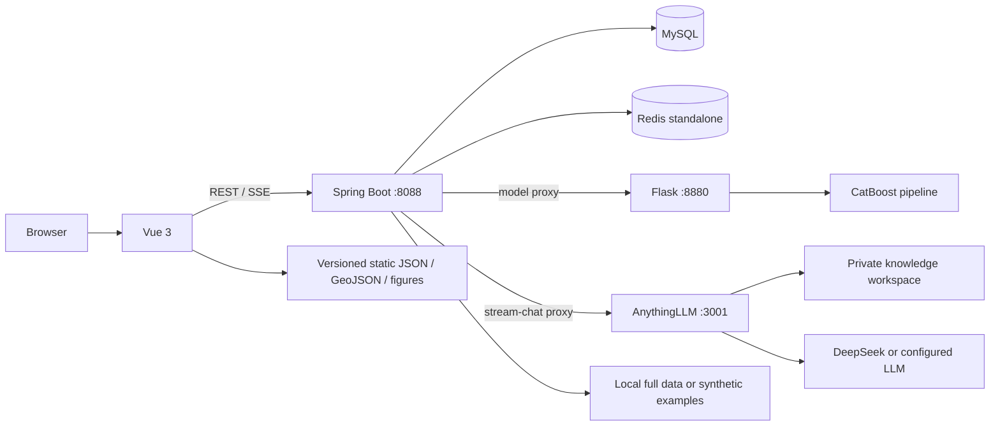

# HNBLUE — Hainan Blue Carbon Digital Application System

English · [简体中文](README.zh-CN.md)

HNBLUE is a full-stack research and management prototype for blue-carbon data governance, regional visualization, biomass-model inference, governance workflows, and knowledge-assisted analysis in Hainan, China.

The project integrates a Vue 3 client, a Spring Boot application layer, MySQL, standalone Redis, a Flask/CatBoost inference service, and an optional AnythingLLM + DeepSeek knowledge assistant. The browser talks to Spring Boot only; Spring Boot owns business rules and proxies model and AI services so internal endpoints and credentials are not exposed to the client.

> **Scope:** HNBLUE is a research, teaching, and decision-support system. It is not an official carbon-accounting, carbon-credit verification, or production monitoring platform. Model output, literature summaries, remote-sensing proxies, and AI responses require domain review before scientific or operational use.

## Highlights

- Source-aware blue-carbon data catalog with region, year, indicator, quality, proxy, simulation, citation, and license metadata.
- Public data explorer and governance workbench for mangrove area, regional indicators, literature evidence, and work orders.
- Hainan city/county thematic map with traceable GeoJSON and attributed remote-sensing/UAV figures.
- Browsing APIs for BAAD, Tallo, ChinAllomeTree, and GWM-style external data packages.
- Spring Boot proxy for single and batch CatBoost inference.
- Virtual-plot scenarios, carbon-value conversion, and offline model interpretation artifacts.
- AnythingLLM workspace retrieval with DeepSeek generation and Server-Sent Events (SSE) streaming.
- Redis-backed query caching, login rate limiting, password-reset state, and role-aware work-order transitions.

## Architecture



| Layer | Technology | Responsibility |
|---|---|---|
| Client | Vue 3, Vue Router, Element Plus, ECharts, Axios | Navigation, forms, maps, charts, tables, and streamed AI output |
| Application | Java 17, Spring Boot 3.1.4, JPA, JDBC | Authentication, authorization, work orders, data APIs, caching, and service proxies |
| Persistence | MySQL 8 | Users, governance records, sources, regions, indicators, and structured facts |
| Cache/state | Redis | Query cache, login counters, temporary bans, and password-reset state |
| Model | Python, Flask, CatBoost, scikit-learn | Pipeline loading, single/batch inference, and analysis endpoints |
| Knowledge assistant | AnythingLLM, DeepSeek, RAG, SSE | Workspace retrieval, answer generation, source metadata, and streaming |

## Request flows

**Data query**

```text
Vue -> Spring controller/service -> Redis cache
                                -> MySQL on cache miss -> Redis
```

**Model inference**

```text
StructurePredictor / VirtualPlotDesigner
  -> /api/model/*
  -> Spring ModelProxyController
  -> Flask
  -> catboost_pipeline.pkl
```

**Knowledge-assisted answer**

```text
Vue EventSource
  -> GET /api/chat/stream-carbon
  -> Spring SSE adapter
  -> AnythingLLM workspace retrieval
  -> configured DeepSeek/LLM provider
  -> status / delta / meta / done events
```

## Repository layout

```text
HNBLUE/
├─ frontend/        Vue application and public map/data assets
├─ backend/         Spring Boot APIs, persistence, cache, security, and tests
├─ flask_model/     Training scripts, model artifacts, and Flask inference API
├─ data/examples/   Small synthetic external-data package committed to Git
├─ data/raw/        Optional full datasets; ignored by Git
├─ sql/             Schema, seed previews, and controlled import scripts
├─ scripts/         Data audit, normalization, import, and geospatial tooling
├─ docs/            Architecture, API, validation, and delivery evidence
├─ figures/         Model and system figures
└─ reports/         Data-gap and validation summaries
```

## Public data policy

The public repository intentionally does **not** contain complete BAAD, Tallo, ChinAllomeTree, GWM, database dumps, AnythingLLM storage, Redis/MySQL volumes, or local execution traces.

`data/examples/` contains 15 tiny synthetic CSV files that reproduce the directory and parser contract expected by `ExternalDatasetService`. These rows are fabricated for interface demonstrations and parser tests; they are not scientific observations and must not be used for model training or carbon accounting.

When a licensed full package is available, place it under the ignored `data/raw/` tree:

```text
data/raw/
├─ baad/BAAD_cleaned.csv
├─ tallo/Tallo.csv
├─ chinallometree/
│  ├─ ChinAllomeTree_cleaned.csv
│  ├─ ChinAllomeTree.xlsx - General.csv
│  └─ ChinAllomeTree.xlsx - Equation.csv
└─ gwm/
   ├─ Mangrove_country.csv
   ├─ Mangrove_global.csv
   └─ ... eight matching ecosystem/level files
```

The locally audited full package contains 528,420 reference rows, but that number describes external research records—not Hainan field observations and not records committed to this repository.

## Prerequisites

- JDK 17
- Node.js 18+ and npm
- Python 3.11
- MySQL 8
- Redis 6+
- Optional: AnythingLLM with an `hnblue` workspace and an LLM provider

## Configuration

Copy `.env.example` into your local secret-management workflow. Spring Boot reads environment variables directly; it does not automatically load a root `.env` file unless your launcher or process manager exports it.

Required for an integrated environment:

| Variable | Purpose |
|---|---|
| `DB_URL`, `DB_USERNAME`, `DB_PASSWORD` | MySQL connection |
| `REDIS_HOST`, `REDIS_PORT`, `REDIS_DATABASE` | Redis connection |
| `MODEL_API_URL` | Flask base URL; default `http://127.0.0.1:8880` |
| `HNBLUE_EXTERNAL_DATA_ROOT` | Full or example external-data root |
| `HNBLUE_JWT_SECRET` | JWT HMAC secret, at least 32 UTF-8 bytes |
| `CORS_ALLOWED_ORIGINS` | Comma-separated browser-origin allowlist |

Optional integrations:

| Variable | Purpose |
|---|---|
| `ANYTHINGLLM_API_URL` | AnythingLLM API base URL |
| `ANYTHINGLLM_API_KEY` | Server-side AnythingLLM API key |
| `ANYTHINGLLM_WORKSPACE` | Workspace slug; default `hnblue` |
| `DEEPSEEK_API_KEY` | Direct provider integration retained by the backend |
| `MAIL_HOST`, `MAIL_PORT`, `MAIL_USERNAME`, `MAIL_PASSWORD` | Password-reset email |
| `HNBLUE_FIELD_ENCRYPTION_SECRET` | Optional JPA field-converter secret |

If `HNBLUE_JWT_SECRET` is absent, the backend generates a process-local key for development. All tokens become invalid after restart. Set a stable secret in every shared or deployed environment.

## Local development

### 1. Start infrastructure

Start MySQL and Redis, then create a local database/user matching your exported variables. Review `sql/` before applying any script: the repository contains design schemas, controlled import scripts, and recorded migration artifacts; they are not all safe to replay against an existing database.

### 2. Start the model service

```powershell
python -m venv .venv
.\.venv\Scripts\python.exe -m pip install -r flask_model\carbon_model_api\requirements.txt
.\.venv\Scripts\python.exe flask_model\carbon_model_api\app.py
```

The inference service uses the committed `catboost_pipeline.pkl`. Python pickle/joblib files can execute code while loading; use only the artifact shipped by this repository or another trusted artifact you built yourself.

### 3. Start the backend

```powershell
cd backend
.\mvnw.cmd spring-boot:run
```

Default endpoint: `http://127.0.0.1:8088`.

### 4. Start the frontend

```powershell
cd frontend
npm ci
npm run serve
```

The development proxy sends `/api`, `/user`, and `/admin` traffic to Spring Boot.

### 5. Optional AnythingLLM

Create an `hnblue` workspace, ingest only documents you are authorized to use, configure the LLM provider, generate a fresh API key, and export the `ANYTHINGLLM_*` variables before starting Spring Boot. Do not expose AnythingLLM port 3001 directly to the public internet.

## Health checks

```powershell
Invoke-RestMethod http://127.0.0.1:8880/ping
Invoke-RestMethod http://127.0.0.1:8088/api/v2/health
Invoke-RestMethod http://127.0.0.1:8088/api/model/health
```

## Build and test

Backend:

```powershell
cd backend
.\mvnw.cmd clean test
.\mvnw.cmd clean package -DskipTests
```

Frontend:

```powershell
cd frontend
npm ci
npm run audit:delivery
npm run build
```

Model environment:

```powershell
python -m pip install -r flask_model/carbon_model_api/requirements.txt
python -m pip check
```

## Model scope and interpretation

The deployed CatBoost pipeline accepts 12 structural, climate, location, and categorical features. The training code targets BAAD field `m.so`, representing above-ground dry biomass in the source workflow. A raw API prediction is therefore not, by itself, a validated per-hectare carbon-stock estimate. Area, stand density, carbon fraction, units, local calibration, and uncertainty must be handled explicitly for scientific use.

Repository documents record an overall test result around `R² = 0.947` and a condition-filtered “mangrove-like” subset around `R² = 0.980`. These are historical experiment records, not guarantees on independent Hainan field data. Reproducible publication should add versioned data, leakage-safe preprocessing, grouped validation, machine-readable metrics, and independent local validation.

SHAP figures, sensitivity analysis, response curves, and virtual plots explain model behavior; they do not establish ecological causality.

## Security notes

- Never commit API keys, JWT secrets, database/mail credentials, private `.env` files, database dumps, or internal documents.
- CORS defaults to explicit localhost origins; set `CORS_ALLOWED_ORIGINS` for the deployed hostname.
- Redis write/read demonstration endpoints and the rate-limit demo endpoint are available only under the Spring `dev` profile.
- Keep MySQL, Redis, Flask, and AnythingLLM on private interfaces. Expose only the reverse proxy over HTTPS.
- Rotate any credential that may previously have been copied into source, logs, screenshots, or Git history.
- The current authentication and AI interfaces are suitable for controlled demonstrations, not an unreviewed public production deployment.

## Evidence and limitations

Validation records are under `docs/context/`, `docs/v2/`, and `reports/`. They document specific local environments and dates; they are not service-level agreements.

Known boundaries include incomplete local field/flux/UAV raw data, static rather than live remote-sensing assets, environment-dependent AnythingLLM availability, and research-analysis pages that are not all wired into the public UI.

## License and third-party material

Project source code is released under the [Apache License 2.0](LICENSE). Third-party datasets, papers, figures, map boundaries, and model artifacts retain their own licenses and attribution requirements. The repository software license does not automatically grant redistribution rights for external data.

## Documentation

- [Architecture](docs/ARCHITECTURE.md)
- [API reference](docs/API.md)
- [Project context index](docs/context/00_README.md)
- [Known constraints](docs/context/07_known_constraints.md)
- [Local validation baseline](docs/context/13_HNBLUE_本地运行基线验收.md)
- [Redis design and validation](docs/context/14_海南蓝碳平台_Redis缓存设计与验证.md)
- [Map and UAV asset validation](docs/context/16_海南市县级蓝碳地图与遥感影像资产接入验证.md)
- [External dataset audit](docs/context/17_外部数据集数据库审计.md)
