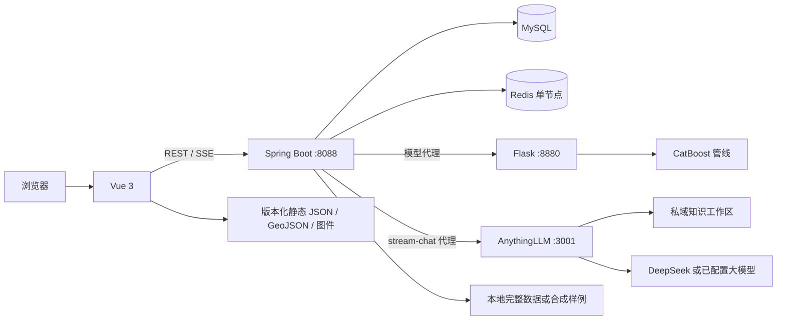

# HNBLUE — 海南蓝碳数字化应用系统

[English](README.md) · 简体中文

HNBLUE 是面向海南蓝碳数据治理、区域专题展示、生物量模型推理、治理业务协同和私域知识问答的全栈研究与管理原型。

系统由 Vue 3 前端、Spring Boot 应用层、MySQL、单节点 Redis、Flask/CatBoost 推理服务以及可选的 AnythingLLM + DeepSeek 知识助手组成。浏览器只访问 Spring Boot；业务规则、模型代理和 AI 代理统一留在服务端，避免把内部地址和凭据暴露给前端。

> **适用边界：** HNBLUE 用于科研、教学、项目演示和辅助研判，不是官方碳核算、碳信用核证或生产监测平台。模型结果、文献统计、遥感代理指标和 AI 回答在科研或业务使用前都需要专业复核。

## 核心能力

- 建立带区域、年份、指标、质量、代理值、模拟值、引用和许可信息的蓝碳数据目录；
- 提供公开数据中心和治理工作台，展示红树林面积、区域指标、文献证据和工作单；
- 提供海南市县级专题地图，以及有来源说明的遥感/UAV 图件；
- 提供 BAAD、Tallo、ChinAllomeTree、GWM 目录结构的外部数据浏览接口；
- 通过 Spring Boot 统一代理 CatBoost 单条和批量推理；
- 提供虚拟样地、碳价值换算和离线模型解释产物；
- 通过 AnythingLLM 检索私域知识，由 DeepSeek 或其他已配置模型生成回答，并使用 SSE 流式返回；
- 使用 Redis 完成热点查询缓存、登录限流和密码重置状态管理，并实现分级工作单流转。

## 系统架构



| 层次 | 技术 | 职责 |
|---|---|---|
| 前端 | Vue 3、Vue Router、Element Plus、ECharts、Axios | 路由、表单、地图、图表、表格和 AI 流式展示 |
| 应用层 | Java 17、Spring Boot 3.1.4、JPA、JDBC | 身份、权限、工作单、数据接口、缓存和服务代理 |
| 持久化 | MySQL 8 | 用户、治理记录、来源、区域、指标和结构化事实 |
| 缓存/状态 | Redis | 查询缓存、登录计数、临时封禁和密码重置状态 |
| 模型 | Python、Flask、CatBoost、scikit-learn | 模型加载、单条/批量推理和分析接口 |
| 知识助手 | AnythingLLM、DeepSeek、RAG、SSE | 工作区检索、答案生成、来源元数据和流式传输 |

## 三条主要调用链

**普通数据查询**

```text
Vue -> Spring Controller/Service -> Redis 命中直接返回
                               -> 未命中时查询 MySQL -> 回填 Redis
```

**模型推理**

```text
StructurePredictor / VirtualPlotDesigner
  -> /api/model/*
  -> Spring ModelProxyController
  -> Flask
  -> catboost_pipeline.pkl
```

**私域知识问答**

```text
Vue EventSource
  -> GET /api/chat/stream-carbon
  -> Spring SSE 适配层
  -> AnythingLLM 工作区检索
  -> DeepSeek/已配置模型生成
  -> status / delta / meta / done 事件
```

## 项目目录

```text
HNBLUE/
├─ frontend/        Vue 应用和公开地图/数据资产
├─ backend/         Spring Boot API、持久化、缓存、安全控制和测试
├─ flask_model/     训练脚本、模型制品和 Flask 推理 API
├─ data/examples/   提交到 Git 的小型合成外部数据包
├─ data/raw/        可选完整数据集；Git 默认忽略
├─ sql/             数据模型、seed 预览和受控导入脚本
├─ scripts/         数据审计、规范化、导入和地理空间工具
├─ docs/            架构、API、验收和交付证据
├─ figures/         模型和系统图件
└─ reports/         数据缺口与验证摘要
```

## 公开数据策略

公开仓库不会上传完整 BAAD、Tallo、ChinAllomeTree、GWM 数据、数据库备份、AnythingLLM 本地存储、Redis/MySQL 数据卷或本机运行痕迹。

`data/examples/` 包含 15 个很小的**合成 CSV**，目录和解析契约与 `ExternalDatasetService` 预期一致。所有行均为演示构造，不是从上述数据集抽取的真实观测，不能用于科研分析、模型评价或碳核算。

取得合法授权的完整数据后，可按以下目录放入已被 Git 忽略的 `data/raw/`：

```text
data/raw/
├─ baad/BAAD_cleaned.csv
├─ tallo/Tallo.csv
├─ chinallometree/
│  ├─ ChinAllomeTree_cleaned.csv
│  ├─ ChinAllomeTree.xlsx - General.csv
│  └─ ChinAllomeTree.xlsx - Equation.csv
└─ gwm/
   ├─ Mangrove_country.csv
   ├─ Mangrove_global.csv
   └─ ... 其余八个生态系统/层级文件
```

本地审计过的完整外部数据包共有 528,420 条参考记录。这个数字表示外部科研数据，不是海南本地实测数量，也不是当前 GitHub 仓库上传的数据量。

## 环境要求

- JDK 17
- Node.js 18+ 与 npm
- Python 3.11
- MySQL 8
- Redis 6+
- 可选：已建立 `hnblue` 工作区并配置大模型的 AnythingLLM

## 配置

将 `.env.example` 复制到本地的私密配置流程中。Spring Boot 会读取环境变量，但不会自动加载根目录 `.env`；需要由 IDE、PowerShell、Docker Compose 或进程管理器导出变量。

完整联调需要：

| 环境变量 | 用途 |
|---|---|
| `DB_URL`、`DB_USERNAME`、`DB_PASSWORD` | MySQL 连接 |
| `REDIS_HOST`、`REDIS_PORT`、`REDIS_DATABASE` | Redis 连接 |
| `MODEL_API_URL` | Flask 地址，默认 `http://127.0.0.1:8880` |
| `HNBLUE_EXTERNAL_DATA_ROOT` | 完整或样例外部数据根目录 |
| `HNBLUE_JWT_SECRET` | JWT HMAC 密钥，至少 32 个 UTF-8 字节 |
| `CORS_ALLOWED_ORIGINS` | 允许访问后端的浏览器来源白名单 |

可选集成：

| 环境变量 | 用途 |
|---|---|
| `ANYTHINGLLM_API_URL` | AnythingLLM API 地址 |
| `ANYTHINGLLM_API_KEY` | 仅由服务端使用的 AnythingLLM Key |
| `ANYTHINGLLM_WORKSPACE` | 工作区标识，默认 `hnblue` |
| `DEEPSEEK_API_KEY` | 后端保留的直接模型供应商配置 |
| `MAIL_HOST`、`MAIL_PORT`、`MAIL_USERNAME`、`MAIL_PASSWORD` | 密码重置邮件 |
| `HNBLUE_FIELD_ENCRYPTION_SECRET` | 可选 JPA 字段加密转换器密钥 |

未设置 `HNBLUE_JWT_SECRET` 时，后端会为本地开发生成进程级临时密钥，进程重启后旧 Token 全部失效。共享或部署环境必须设置稳定且安全的密钥。

## 本地运行

### 1. 基础设施

启动 MySQL 和 Redis，并根据已导出的环境变量建立本地数据库和用户。执行 `sql/` 中任何脚本前必须先阅读说明并备份：仓库中同时存在总体设计 DDL、受控导入脚本和迁移执行记录，不能全部对已有数据库重复运行。

### 2. 模型服务

```powershell
python -m venv .venv
.\.venv\Scripts\python.exe -m pip install -r flask_model\carbon_model_api\requirements.txt
.\.venv\Scripts\python.exe flask_model\carbon_model_api\app.py
```

推理服务使用仓库中的 `catboost_pipeline.pkl`。Python pickle/joblib 文件在加载时可以执行代码，只能加载本仓库提供或自行从可信代码训练的制品。

### 3. Spring Boot 后端

```powershell
cd backend
.\mvnw.cmd spring-boot:run
```

默认地址：`http://127.0.0.1:8088`。

### 4. Vue 前端

```powershell
cd frontend
npm ci
npm run serve
```

开发代理会把 `/api`、`/user` 和 `/admin` 请求发送给 Spring Boot。

### 5. 可选 AnythingLLM

创建 `hnblue` 工作区，只导入有权使用的知识材料，配置大模型供应商并生成新的 API Key，再导出 `ANYTHINGLLM_*` 变量。不要把 AnythingLLM 的 3001 端口直接暴露到公网。

## 健康检查

```powershell
Invoke-RestMethod http://127.0.0.1:8880/ping
Invoke-RestMethod http://127.0.0.1:8088/api/v2/health
Invoke-RestMethod http://127.0.0.1:8088/api/model/health
```

## 构建与测试

后端：

```powershell
cd backend
.\mvnw.cmd clean test
.\mvnw.cmd clean package -DskipTests
```

前端：

```powershell
cd frontend
npm ci
npm run audit:delivery
npm run build
```

Python 推理环境：

```powershell
python -m pip install -r flask_model/carbon_model_api/requirements.txt
python -m pip check
```

## 模型口径

部署的 CatBoost 管线使用 12 个结构、气候、位置和类别特征。训练代码的目标是 BAAD 字段 `m.so`，即该流程中的地上部干生物量。API 原始预测不能直接等同于已验证的单位面积碳储量；科研使用还要明确面积、林分密度、碳比例、单位、本地校准和不确定性。

仓库文档记录的总体测试结果约为 `R² = 0.947`，特定条件筛选的“类红树林”子集约为 `R² = 0.980`。这些是项目实验记录，不是对独立海南实测数据的性能保证。正式科研复现还需要版本化数据、无泄漏预处理、分组验证、机器可读指标和本地独立验证。

SHAP、敏感性分析、响应曲线和虚拟样地用于解释模型行为，不证明生态因果关系。

## 安全说明

- 禁止提交 API Key、JWT 密钥、数据库/邮件凭据、私有 `.env`、数据库备份和内部材料；
- CORS 默认只允许显式本地来源，部署时应通过 `CORS_ALLOWED_ORIGINS` 设置正式域名；
- Redis 任意读写演示接口和限流演示接口只在 Spring `dev` Profile 下启用；
- MySQL、Redis、Flask 和 AnythingLLM 应只监听私网接口，对公网只开放 HTTPS 反向代理；
- 任何曾被复制到源码、日志、截图或 Git 历史中的凭据都应立即轮换；
- 当前认证和 AI 接口适合受控演示，未经安全复核不应直接作为公网生产系统。

## 验证证据和限制

`docs/context/`、`docs/v2/` 和 `reports/` 保存特定本地环境与日期的验证记录，它们不是服务等级协议。

当前边界包括：本地样地/通量/UAV 原始数据仍不完整，遥感资产主要为静态图件，AnythingLLM 可用性依赖环境，部分科研分析页面尚未形成完整公开交互闭环。

## 许可证与第三方材料

项目源代码采用 [Apache License 2.0](LICENSE)。第三方数据、论文、图片、地图边界和模型制品仍遵循各自的许可和署名要求；仓库的软件许可证不会自动授予外部数据的再分发权。

## 文档导航

- [系统架构](docs/ARCHITECTURE.md)
- [API 说明](docs/API.md)
- [项目上下文索引](docs/context/00_README.md)
- [已知约束](docs/context/07_known_constraints.md)
- [本地运行基线](docs/context/13_HNBLUE_本地运行基线验收.md)
- [Redis 设计与验证](docs/context/14_海南蓝碳平台_Redis缓存设计与验证.md)
- [地图与 UAV 资产验证](docs/context/16_海南市县级蓝碳地图与遥感影像资产接入验证.md)
- [外部数据审计](docs/context/17_外部数据集数据库审计.md)
