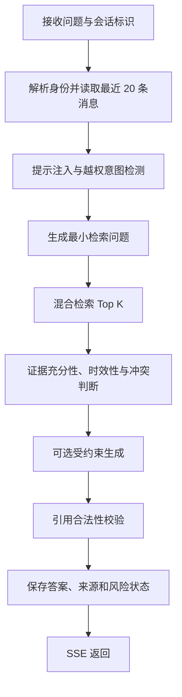

# HNBLUE Agentic RAG 设计

## 1. 目标

HNBLUE 的知识助手不是“把问题转发给大模型”的聊天壳，而是一条可审计的证据决策链。它解决四个工程问题：如何在小型服务器上稳定检索中文材料，如何阻止模型越过证据边界，如何让多轮对话不串用户，以及如何在生成服务不可用时仍然提供有用结果。

公开仓库只提供算法、接口、合成知识包和合成评测题。真实知识、真实索引、真实对话、内部评测集和部署运行记录不进入 Git。

## 2. 单轮 Agent 状态机

所有连线只表达纵向的处理顺序。任何阶段失败都进入明确的拒答或摘录式降级，不会静默跳过安全检查。

## 3. 检索设计

| 组件 | 作用 | 选择原因 |
|---|---|---|
| BM25 | 精确术语和稀有词召回 | 可解释、CPU 友好 |
| 中文字符 TF-IDF | 处理分词不稳定、简称和局部重叠 | 无外部分词器依赖 |
| LSA | 低成本潜在语义召回 | 小型服务器可运行 |
| 标题 TF-IDF | 提高章节名、接口名和主题名权重 | 减少长正文稀释 |
| 加权 RRF | 融合不同排序器 | 不强依赖分数标定 |
| 来源去重 | 避免相邻块占满 Top K | 增加证据多样性 |

Markdown 按标题树和相邻段落语义断点切分；CSV、JSON、TXT 作为原子文档。每个块保留标题、章节路径、相邻上下文、来源路径与文件哈希。

## 4. 证据门控

检索结果不会自动进入生成。系统还会判断：

- 问题是否属于 HNBLUE/蓝碳/平台使用范围；
- Top K 是否达到最低相关强度；
- 是否涉及最新政策、实时价格、正式核证或交易决策；
- 是否出现正式版与草案、不同单位或不同数据类别冲突；
- 用户是否要求忽略来源、伪造结论、泄露密钥或把模拟数据描述为实测。

证据不足时返回明确拒答；冲突存在时要求分别呈现；高时效或法定判断要求用户回到主管部门原文和正式数据库复核。

## 5. 受约束生成与回退

DeepSeek 是可选的语言生成器，不承担检索和事实判定。Spring Boot 只发送当前问题、最小指代消解上下文和最多五个证据块。每个事实性段落必须包含合法的 `[S1]...[Sn]` 引用。

以下情况自动回退为摘录式回答：

- 未配置生成 Key；
- 供应商超时或返回错误；
- 回答没有引用；
- 引用编号超出本轮证据集合；
- 证据状态不是 `retrieved`。

这个设计把“可用性”与“生成模型是否在线”解耦，也让失败行为可预测、可测试。

## 6. 会话记忆

- 短期上下文：当前会话最近 20 条消息，用于解析“它、第二项、刚才那个区域”等指代。
- 长期历史：登录用户的消息、回答、来源、证据状态、模型标识和风险状态保存在 MySQL。
- 关键记忆：只保存用户明确表达、与任务直接相关、低敏感且稳定的偏好或上下文。
- 匿名隔离：服务端使用会话标识，不接受客户端直接声明用户 ID。
- 可删除：清理接口只删除当前身份与当前会话的数据。

密码、API Key、身份证件、联系方式、健康信息、完整敏感问题和风控标签不得进入长期记忆。

## 7. 可观测性与评测

接口返回 `provider`、`model`、`sources`、`evidenceStatus`、`injectionRisk` 和有限的检索/生成指标。日志记录错误类型、延迟和匿名会话标识，不记录密钥或完整敏感内容。

公开评测位于 `rag/examples/benchmark_cases.json`，仅验证合成知识的召回链路。私有部署应另外维护冻结的真实评测集，并同时衡量检索 Recall、无答案拒答率、提示注入拦截率、冲突识别率、引用合法率和人工事实一致性。

## 8. 扩展点

- 将 LSA 替换或补充为本地/远程向量嵌入；
- 增加 reranker，但保留可解释的第一阶段分数；
- 为不同资料等级设置独立的证据阈值；
- 增加会话保留期任务和用户数据导出；
- 将 Agent 工具扩展到只读结构化查询，同时为每个工具声明权限、超时和输出 Schema。
