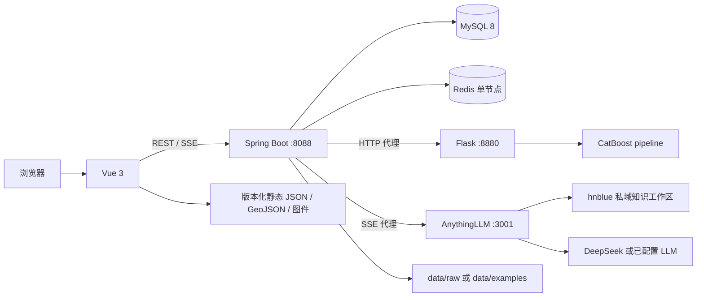

# HNBLUE 系统架构

本文描述当前仓库可运行代码所对应的架构。历史方案和已停用部署记录只作为背景保存在归档文档中，不代表当前运行拓扑。

## 1. 设计目标与边界

HNBLUE 将海南蓝碳相关的结构化事实、地图与遥感图件、外部科研数据、模型推理、治理流程和知识问答放在一个统一应用中。架构上的核心判断是：浏览器只连接 Spring Boot，由服务端统一管理身份、业务规则、缓存以及对模型和人工智能服务的访问。

系统定位为科研、教学和辅助研判原型，不替代官方碳核算、碳信用核证或生产监测。模型预测、遥感代理指标和大模型回答都需要专业复核。

## 2. 当前总体拓扑



当前实现使用单节点 Redis。`docs/archive/redis-cluster-legacy/` 记录的是历史集群实验，不是默认部署要求。

## 3. 分层职责

| 层 | 组件 | 当前职责 |
|---|---|---|
| 表现层 | Vue 3、Vue Router、Element Plus、ECharts、Axios | 页面路由、表单、数据表、地图、图表、模型参数输入和 SSE 增量展示 |
| 应用层 | Java 17、Spring Boot 3.1.4 | 登录注册、用户/管理员接口、工作单状态机、数据查询、缓存、模型代理和 AI 代理 |
| 数据层 | MySQL 8、JPA、JDBC | 用户、治理业务记录、区域/来源/指标等结构化数据；JDBC 也用于可控的数据目录查询 |
| 缓存与短期状态 | Redis | 热点查询缓存、登录窗口计数、临时封禁和密码重置状态 |
| 模型服务 | Python 3.11、Flask、CatBoost、scikit-learn | 可信模型制品加载、单条和批量推理、模型分析接口 |
| 知识服务 | AnythingLLM、检索增强生成、DeepSeek/其他 LLM | 从 `hnblue` 工作区检索私域材料，生成带上下文的回答 |

## 4. 三条核心调用链

### 4.1 数据查询

```text
Vue -> Spring Controller -> V2DataService -> Redis
                                      └─ 未命中 -> MySQL -> 写回 Redis
```

`V2DataService` 使用 Spring `@Cacheable`。缓存键由规范化筛选条件生成，统一使用 `hnblue:cache:v2:` 前缀。不同查询按变化频率设置 10 分钟至 6 小时的生存时间（Time To Live，TTL），避免长期返回过期结果。

外部数据浏览先检查数据库中是否存在经过确认的对应表；没有时读取 `HNBLUE_EXTERNAL_DATA_ROOT` 指向的 CSV。若未提供完整数据，服务会回退到仓库内 `data/examples/` 的合成样例。

### 4.2 模型推理

```text
Vue -> POST /api/model/predict-carbon
    -> Spring ModelProxyController
    -> Flask /predict
    -> catboost_pipeline.pkl
    -> JSON 结果原路返回
```

浏览器不直接访问 Flask。这样可以把模型地址、超时、错误转换和未来的鉴权策略留在 Spring Boot，并避免把推理服务暴露在公网。Flask 单独部署，是因为训练和推理依赖 Python 生态，而用户、权限、数据库事务等业务逻辑更适合保留在 Java 应用层；两者可独立扩缩容和替换模型。

模型制品接受 12 个结构、气候、位置及类别特征，训练目标来自 BAAD 流程中的 `m.so`（地上部干生物量）。原始输出不能直接当作单位面积碳储量；面积、密度、碳比例、单位、本地校准和不确定性需要在科研使用时另行处理。

### 4.3 私域知识问答

```text
Vue EventSource
  -> GET /api/chat/stream-carbon
  -> Spring CarbonAssistantController
  -> AnythingLLM workspace stream-chat
  -> 私域检索 + DeepSeek/已配置大语言模型生成
  -> status / delta / meta / done / error 事件
```

服务器发送事件（Server-Sent Events，SSE）适合“一次提问、服务端持续增量输出”的单向场景。Spring Boot 保管 AnythingLLM API Key，转发上游流并统一对浏览器输出事件；浏览器因此不需要知道内网地址或密钥。AnythingLLM 负责工作区文档检索和会话编排，DeepSeek 或其他已配置的大语言模型（Large Language Model，LLM）负责生成文本。

## 5. 数据与来源边界

- `sql/` 包含数据库设计、预览 seed、导入脚本和迁移记录。执行前必须阅读脚本用途并备份数据库。
- `frontend/public/data/` 保存可公开展示的地图、规范化摘要和无人机（Unmanned Aerial Vehicle，UAV）资产清单。
- `data/examples/` 是 15 个很小的合成 CSV，只用于接口演示和解析测试。
- `data/raw/` 是本地完整外部数据目录，默认被 Git 忽略；公开仓库不包含完整 BAAD、Tallo、ChinAllomeTree 或 Global Wetland Map（GWM）数据。
- 完整本地包的 528,420 条记录是外部科研参考记录总数，不代表海南本地实测样本量。

静态地图和遥感资产随前端版本发布，适合可复现演示；它们不是实时遥感流水线。MySQL 则用于可更新的业务和结构化事实数据。

## 6. 身份、权限与治理流程

- 登录成功后由 `JwtUtils` 生成 JSON Web Token（JWT）；用户接口从 `Authorization: Bearer <token>` 读取身份。
- 管理员接口在控制器/服务层校验 Token 与角色；工作单控制器按普通用户、分配管理员等参与者约束状态变化。
- 工作单覆盖创建、受理、提交审核、批准、驳回、退回、关闭和评论，避免把数据修改治理简化为任意数据库写入。
- 登录接口以“客户端地址 + 请求路径”为 Redis Key，在 3 秒固定窗口内允许最多 10 次请求，超限后临时封禁 60 秒并返回 HTTP 429。
- Redis 不可用时，当前限流实现选择降级放行以保证登录可用。因此 Redis 既是性能组件也是安全控制依赖，生产部署应监控其可用性并在入口层增加第二道限流。

并非所有 `/api/v2` 数据和 AI 接口都已经统一纳入认证过滤器；当前权限实现是控制器级的，不应直接视为完整生产级安全框架。

## 7. Redis 缓存策略

当前主要缓存及 TTL：

| 缓存 | TTL |
|---|---:|
| `dashboard-summary` | 10 分钟 |
| `sources` | 6 小时 |
| `mangrove-cover` | 30 分钟 |
| `region-metrics` | 30 分钟 |
| `literature-carbon` | 2 小时 |
| `region-overview` | 15 分钟 |
| `ai-context` | 10 分钟 |

只缓存成功且非空的查询结果。Redis 还承担登录计数、临时封禁和密码重置状态，所以部署时要设置访问控制、持久化策略和监控，不能直接暴露到公网。

## 8. 网络与密钥边界

- 公网入口应为 HTTPS 反向代理；只把前端和 Spring Boot 暴露给用户。
- MySQL、Redis、Flask 和 AnythingLLM 应绑定私网或本机接口。
- 数据库、邮件、AnythingLLM、DeepSeek、JWT 和字段加密密钥均由环境变量提供。
- 跨域资源共享（Cross-Origin Resource Sharing，CORS）默认只允许显式本地来源，部署时通过 `CORS_ALLOWED_ORIGINS` 配置正式域名。
- 任意 Redis 读写接口和限流演示接口仅在 Spring `dev` Profile 下注册。
- Git 不跟踪 `.env`、数据库卷、完整数据、生成日志、Python 缓存和内部软著材料。

## 9. 部署与可用性判断

基础演示至少需要 MySQL、Redis、Flask、Spring Boot 和 Vue。AnythingLLM 是可选依赖；未配置时，普通数据、工作单和模型功能仍可单独运行。模型和 AI 健康状态应通过 Spring Boot 的代理接口检查，而不是从公网直接探测内部端口。

当前代码适合受控环境中的完整项目演示。若进入公网生产环境，还需要补充统一认证/授权过滤链、密码重置安全改造、入口网关限流、审计日志、密钥托管、数据库迁移工具、容器健康检查、持续集成和独立海南数据验证。

## 10. 代码证据入口

- 前端路由与 API：`frontend/src/router/`、`frontend/src/api/`
- 数据接口与缓存：`backend/src/main/java/com/example/jpaspringboot/controller/V2ApiController.java`、`service/V2DataService.java`、`config/RedisConfig.java`
- 外部数据：`controller/ExternalDatasetController.java`、`service/ExternalDatasetService.java`
- 鉴权与限流：`controller/LoginController.java`、`util/JwtUtils.java`、`interceptor/AccessLimitInterceptor.java`
- 工作单：`controller/WorkOrderController.java`、`service/WorkOrderService.java`
- 模型代理：`controller/ModelProxyController.java`、`flask_model/carbon_model_api/`
- AI 流：`controller/CarbonAssistantController.java`
- 配置：`backend/src/main/resources/application.properties`、`.env.example`
